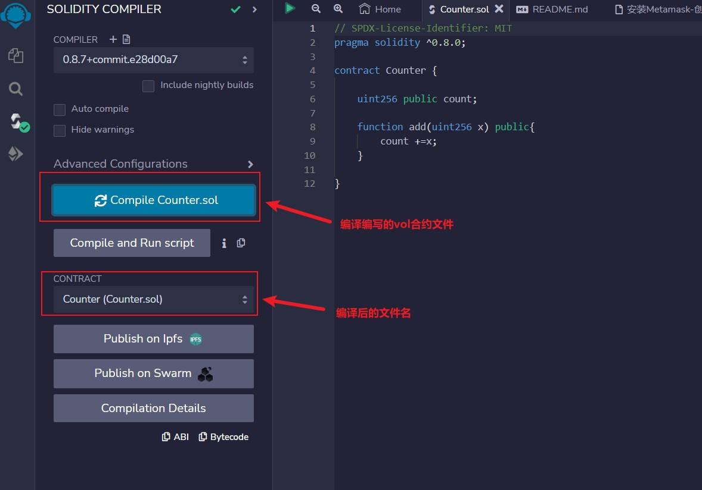
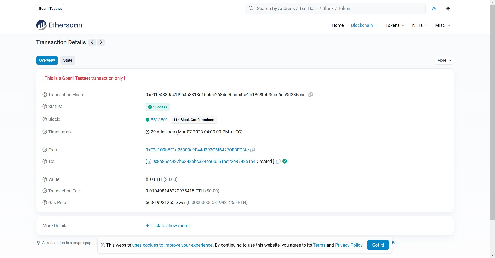

## 作业一：安装Metamask、并创建好账号
#### 账号1 Hash：0xd34B23E1D454908Be14382EbCD8187EdD6d9cECd
#### 账号2 Hash：0xE2e109b6F1a25309c9F44d392C6f64270B3FD3fc


## 作业二：执行一次转账
#### From：0xe2e109b6f1a25309c9f44d392c6f64270b3fd3fc
#### To：0xd34b23e1d454908be14382ebcd8187edd6d9cecd
#### 交易hash：0x9fe7d8e6e8daa0546d842bfcac0f5df1ed156db0b7e9aaca8b1f6fb8ed1bc5f6
#### 交易url：[https://goerli.etherscan.io/tx/0x9fe7d8e6e8daa0546d842bfcac0f5df1ed156db0b7e9aaca8b1f6fb8ed1bc5f6](https://goerli.etherscan.io/tx/0x9fe7d8e6e8daa0546d842bfcac0f5df1ed156db0b7e9aaca8b1f6fb8ed1bc5f6)


## 作业三：使用Remix创建一个Counter合约并部署（包含add方法）

#### Counter合约：
```Solidity
// SPDX-License-Identifier: MIT
pragma solidity 0.8.0;
contract Counter{
    uint256 count = 0;

    function addCount(uint256 x) public {
        count += x;
    }
}
```

#### 编译

#### 部署配置

#### 确认

#### 创建合约报文

#### 区块链浏览器合约交易信息

#### count查看

#### add函数调用


### 合约交易信息
##### 合约地址：0x8a85eC987b6343ebC334ea6b551Ac22e8748E1B4
##### 详情：[https://goerli.etherscan.io/address/0x8a85eC987b6343ebC334ea6b551Ac22e8748E1B4](https://goerli.etherscan.io/address/0x8a85eC987b6343ebC334ea6b551Ac22e8748E1B4)
##### add()交易Hash：0xbfb72d56f6ca5d62f039affb5931c54951586b306c079a0b56b24c4873c8e65b
##### 详情：[https://goerli.etherscan.io/tx/0xbfb72d56f6ca5d62f039affb5931c54951586b306c079a0b56b24c4873c8e65b](https://goerli.etherscan.io/tx/0xbfb72d56f6ca5d62f039affb5931c54951586b306c079a0b56b24c4873c8e65b)
